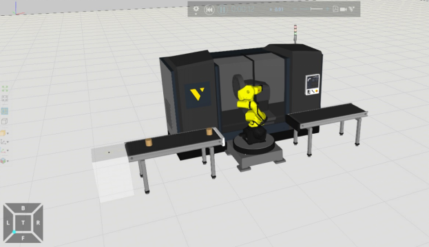
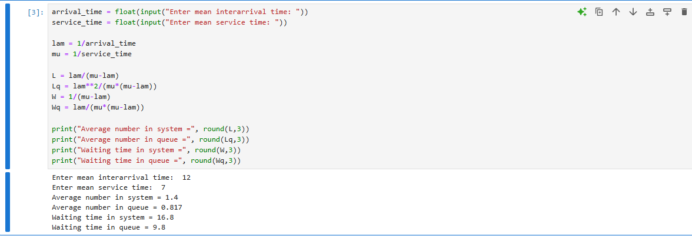

# Single server with infinite capacity (M/M/1):(oo/FIFO)

# date : 18/02/2026 

## Aim :
To find (a) average number of materials in the system (b) average number of materials in the conveyor (c) waiting time of each material in the system (d) waiting time of each material in the conveyor, if the arrival  of materials follow poisson process with the mean interval time 12 seconds, serivice time of lathe machine follows exponential distribution with mean serice time 1 second and average service time of robot is 7seconds.

## Software required :
Visual components and Python

## Theory:
Queuing are the most frequently encountered problems in everyday life. For example, queue at a cafeteria, library, bank, etc. Common to all of these cases are the arrivals of objects requiring service and the attendant delays when the service mechanism is busy. Waiting lines cannot be eliminated completely, but suitable techniques can be used to reduce the waiting time of an object in the system. A long waiting line may result in loss of customers to an organization. Waiting time can be reduced by providing additional service facilities, but it may result in an increase in the idle time of the service mechanism.


This is a queuing model in which the arrival is Marcovian and departure distribution is also Marcovian,number of server is one and size of the queue is also Marcovian,no.of server is one and size of the queue is infinite and service discipline is 1st come 1st serve(FCFS) and the calling source is also finite.

## Procedure :


## Experiment:



 
## Program

```
developed by : Ryan David Prasad
reg. no. : 212224040282

arrival_time = float(input("Enter mean interarrival time: "))
service_time = float(input("Enter mean service time: "))

lam = 1/arrival_time
mu = 1/service_time

L = lam/(mu-lam)
Lq = lam**2/(mu*(mu-lam))
W = 1/(mu-lam)
Wq = lam/(mu*(mu-lam))

print("Average number in system =", round(L,3))
print("Average number in queue =", round(Lq,3))
print("Waiting time in system =", round(W,3))
print("Waiting time in queue =", round(Wq,3))
```

## Output :



## Result :

The average number of material in the sysytem and in the conveyor and waiting time are successfully found.
